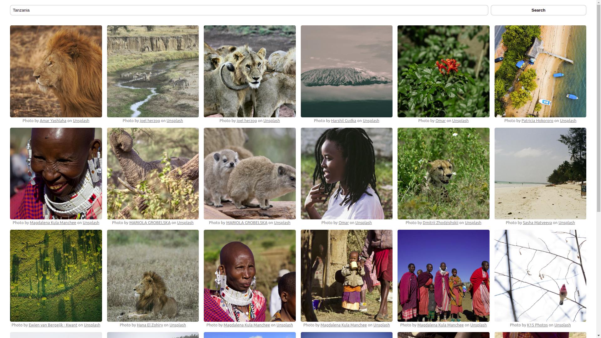

# Unsplash Demo

Testing the Unsplash API

## Screenshots

## Development

### Prerequisites

Install [Git](https://git-scm.com/book/en/v2/Getting-Started-Installing-Git), the free and open source distributed version control system.  
Install [Node.js](https://nodejs.org/) which includes Node Package Manager.  
Install [Yarn](https://yarnpkg.com) Package Manager.  

### Clone and install

Run `git clone git@github.com:orbanszlrd/unsplash-demo.git` to clone the repository from [GitHub](https://github.com/orbanszlrd/unsplash-demo).  
Run `yarn install` or `npm install` to install the dependencies.

### Development server

Run `yarn dev` or `npm run dev` for a dev server.  
Navigate to `http://localhost:3000`  
The app will automatically reload if you change any of the source files.

### Build

Run `yarn build` or `npm run build` to build the project.

### Start the app locally

Run `yarn start` or `npm run start` to start the app.  
Navigate to `http://localhost:3000`

### Deployment

The app is configured to be hosted on cPanel.
If you want to deploy it on Vercel, you need to make some changes to it.

- delete the custom server file: `server.js`
- revert the the `start` script in the `package.json` to its initial value, `next start`

### Configuration

In order to use the Unsplash API, you need to have an [Unsplash Developer](https://unsplash.com/developers) Account.

- Create an Account on [Unsplash Developers](https://unsplash.com/developers)
- Create a New Application
- Generate a Token as described in the [Unsplash Documentation](https://unsplash.com/documentation/user-authentication-workflow)
- Open the `.env` file and set the value of the `UNSPLASH_TOKEN` variable to the newly generated token

### Further help

[React - Getting Started](https://reactjs.org/docs/getting-started.html)  
[Next.js - Documentation](https://nextjs.org/docs)  
[Vercel - Documentation](https://vercel.com/docs)  
[Unsplash Developers - Documentation](https://unsplash.com/documentation)  
[Unsplash Developers - User Authentication Workflow](https://unsplash.com/documentation/user-authentication-workflow)  
